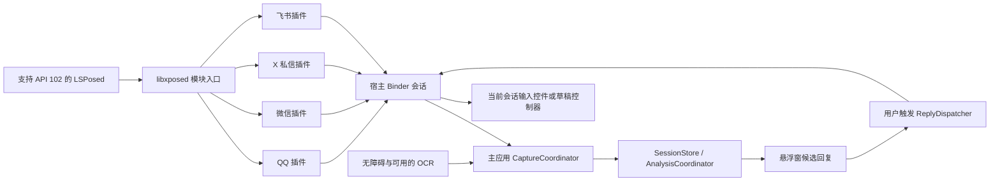

# V1.4 多平台 libxposed 设计与实施方案

状态：同一 APK 的微信 3180 文本采集已落地；编译与 Android 17 设备上的模块加载、聊天页命中、非空正文心跳已验证。用户确认一个测试会话最近 6 条正文和方向一致；草稿填入与模型结果尚待端到端验证。更新日期：2026-09-23。应用版本仍为 `1.3 / versionCode 4`。

本文按用户最新要求替代[最初的微信备用采集评估](v1.4-wechat-capture-plan.md)：优先采用 **libxposed**，按 **QQ → 微信 → X → 飞书** 实施，以聊天信息完整、身份正确、更新及时和回复填入有效为目标。Xposed 不再只是微信节点为空时的补丁，也不再限定为“只能观察可见 View”。

## 1. 方案决策

采用“**一个 APK，同时是主应用与 libxposed 模块**”架构。在用户启用模块、平台适配通过后，以宿主进程内的会话/消息模型为首选数据源，必要时调用内部查询接口、读取当前会话缓存、hook 数据绑定或输入控制器。无障碍和 OCR 保留为兼容模式。共享协议可放在 `:app` 内的独立包，不产生第二个安装包。

允许为功能效果使用侵入式进程内适配，包括明确目标的参数/返回结果适配及用户触发的输入框写入；不再把“不 hook”“只读 View”“绝不接触内部数据层”作为实现约束。每个修改点仍需说明功能目的、作用对象、副作用及撤销方式，避免错误数据和宿主崩溃。

保留产品行为：分析用户当前打开的会话，回复由用户选择、手动发送，不操作转账、红包或支付。当前会话最近消息可超出屏幕可见区域；不把功能扩展为监听所有会话、导出整库或提取登录凭据。采集能力、历史持久化和向模型提交是三个独立开关/状态。

Xposed 模式的读取、分析、悬浮窗与宿主填入不再以无障碍服务开启为前提。没有兼容 hook 的平台继续使用现有路径；无障碍关闭时，其截图 OCR 能力也不可用，不能暗中依赖原服务兜底。

### 平台与功能范围

| 顺序 | 平台与当前包名 | 目标能力 |
| --- | --- | --- |
| 1 | QQ，`com.tencent.mobileqq` | 单聊先闭环，再覆盖群聊；会话身份、文本/引用/@、消息更新、宿主填入 |
| 2 | 微信，`com.tencent.mm` | 节点为空时独立完成相同闭环；单聊后群聊 |
| 3 | X，`com.twitter.android` | 私信会话、结构化消息/发言人、更新与草稿填入；不依赖传统 View 文本 |
| 4 | 飞书，`com.ss.android.lark` | 单聊/群聊的消息模型与富文本、发送者及输入控制器；减少正文 OCR 依赖 |

“现有支持”在此指仓库存在这四个平台的适配器，不代表本轮已验证各平台版本。不能将飞书包的结果推广到其他独立 Lark 包，也不能把 QQ 的结果推广到 TIM/QQ Lite。四个平台都是本专题的最终交付范围；QQ、微信可以先形成阶段测试包，不能据此宣称全部完成。

首轮文本包括正常文本、可取到的引用正文、@ 与系统消息类型；图片、语音、文件等先表示为有类型的占位，不伪造正文。群聊保留具体发送者，不能把所有成员压缩成一个“对方”。语音转写、图片理解和完整历史导出不作为本次首批验收项。

## 2. API 与构建基线：libxposed 102

### 2.1 已核验的发布内容

本轮直接读取 Maven Central 的版本元数据、`102.0.0` sources JAR 与 AAR，而不是根据旧教程推断 API：

| 项目 | 已核验事实 | 设计决定 |
| --- | --- | --- |
| `io.github.libxposed:api` | 元数据的 `latest/release` 为 `102.0.0` | 模块使用固定版本 `compileOnly`，不把框架 API 实现打包到宿主 |
| `io.github.libxposed:service` | 元数据的 `latest/release` 为 `102.0.0` | 后续需要框架状态时在应用进程使用；当前探针未引入 |
| API 102 | `XposedModule`、`onModuleLoaded`、`onPackageReady`、`hook(Executable).intercept(...)` | 用发布包中的 interceptor chain 接口，不照抄早期 modern API 的构造函数/注解 hook 示例 |
| API 隔离 | `XposedInterface` 明确：target 102+ 的模块不能调用 legacy API | 不引入 `XposedHelpers`、`XC_MethodHook` 或 `IXposedHookLoadPackage`；不同时维护 legacy 入口 |
| AAR 构建要求 | API/service 均为 `minCompileSdk=37`、Manifest `minSdkVersion=26` | `:app` compileSdk 已设 37；targetSdk 35、minSdk 30 不随之改变 |
| service 能力 | 框架信息、scope、remote preferences/files、运行目标和热重载等 | 用于控制与诊断，不当作宿主向主应用回传聊天的通用消息总线 |

来源：[API 元数据](https://repo.maven.apache.org/maven2/io/github/libxposed/api/maven-metadata.xml)、[service 元数据](https://repo.maven.apache.org/maven2/io/github/libxposed/service/maven-metadata.xml)、[API 102 源码与 AAR 目录](https://repo.maven.apache.org/maven2/io/github/libxposed/api/102.0.0/)、[service 102 源码与 AAR 目录](https://repo.maven.apache.org/maven2/io/github/libxposed/service/102.0.0/)。

用户给出的[传统 Xposed API 文档](https://api.xposed.info/reference/packages.html)可用于理解 hook 概念，但不是本实现的接口规范。官方 [modern API 指南](https://github.com/LSPosed/LSPosed/wiki/Develop-Xposed-Modules-Using-Modern-Xposed-API)用于确认模块布局；其中接口描述若与发布源码不同，以锁定的 `102.0.0` 源码为准，例如本次发布包的 `Hooker/Chain` 并非该指南描述的泛型形式。

### 2.2 模块声明与依赖

当前 `:app` 配置：

```kotlin
dependencies {
    compileOnly("io.github.libxposed:api:102.0.0")
}
```

`app/src/main/resources/META-INF/xposed/` 中提供：

- `java_init.list`：登记 `io.github.liaong13.dialogueroute.xposed.DialogueRouteModule`。
- `scope.list`：当前仅有微信；后续适配平台再增加包名，并由入口检查进程及能力。
- `module.prop`：建议如下。

```properties
minApiVersion=102
targetApiVersion=102
staticScope=true
exceptionMode=protective
autoHotReload=false
```

不使用 `assets/xposed_init` 和传统 `xposedmodule` Manifest metadata。入口需保留类名，APK 检查不得被通用 `META-INF/**` 排除规则删除；混淆配置按入口与协议边界处理。LSPosed 中选择“对话攻略”这一个已安装应用并启用微信作用域。依据为发布 sources JAR 的 `package-info.java` 和上述 modern 指南。

模块在 `onModuleLoaded` 后初始化；`onPackageReady` 取得实际应用 ClassLoader，再按适配规则等待宿主上下文/业务类可用。不要在构造函数提前 hook。按包名和进程双重过滤；scope 会覆盖包的多个进程，不能用“只勾选 QQ”代替进程判断。

当前工程是 AGP `9.2.1`、Gradle `9.4.1`，使用 AGP 内置 Kotlin；`:app` compileSdk 为 37，targetSdk 35、minSdk 30 不变。需要核对工具链与 API AAR 的实际构建兼容性，不能压制 AAR metadata 检查来绕过。`compileOnly` 保证普通应用运行时不携带 libxposed 实现；普通 UI 代码不得主动加载 libxposed API 类。

运行环境仍按用户指定的 KernelSU + Zygisk Next + LSPosed 路线准备，但必须锁定**实际支持 libxposed API 102 的发行仓库、tag 和构建**。API 102 在 Maven 发布不代表任一名为 LSPosed 的安装包都支持它。运行时分别核对框架 API、模块加载版本、scope、宿主握手与适配命中；不支持时明确提示，使用兼容模式，不私自切换到旧 hook API。

## 3. 现有代码需怎样演进

以下是当前源码核对结果，而非本轮已修复内容：

| 位置 | 当前行为 | 所需调整 |
| --- | --- | --- |
| `capture/ChatCaptureService.kt` | 分发、去重、模型请求、悬浮窗、OCR 和填入都集中在无障碍服务；root/adapter 空时提前返回 | 抽出与采集来源无关的运行服务、协调器、请求状态与填入路由 |
| `capture/QQAdapter.kt` | 依赖 `mjn/input/371` 等节点 ID，以坐标判断发送方向 | 保留为兼容适配器；新 QQ 模型适配用会话/账号/发送者 ID |
| `capture/WeChatAdapter.kt` | 依赖 `bkl`，无该气泡节点就不能触发原自动 OCR | 新模块直接上报会话及数据，不调用旧 `extract()` 来决定是否可读 |
| `capture/XAdapter.kt` | 从节点 `contentDescription` 解析正文和发送者 | 新实现定位 DM 状态/消息集合，语义节点仅用于回退 |
| `capture/FeishuAdapter.kt` | 节点文本或气泡矩形 + OCR；说话人含几何/回执推断 | 新实现读取消息及富文本模型，以发送者字段确定方向 |
| `core/ChatModels.kt` | `Msg(side,text)`，签名只含最后六条文本 | 扩展平台/账号/会话、消息 ID、发送者、类型、修订和来源 |
| `core/PowerSetup.kt`、`MiuixActivity.kt` | readiness 必须满足无障碍、悬浮窗、密钥 | 按 Xposed/兼容模式判定；区分读取可用与模型配置完成 |
| `overlay/OverlayController.kt` | 已用 `TYPE_APPLICATION_OVERLAY`，但由无障碍服务创建 | 转由运行服务拥有，并用请求状态驱动结果展示 |
| `capture/KeepAliveService.kt` | 主要用于维持进程 | 演进为用户可启动/停止的助手运行服务，统一 owner |
| `core/kb/ContextBuilder.kt` | 联系人按标题/应用匹配 | 引入经用户关联的稳定会话身份，处理同名与群聊；不自动创建联系人 |

原有会话串用、过期回调、判断/回复乱序和 OCR 去重问题必须在第二来源接入时统一处理，详见[静态检查记录](project-review-2026-09-23.md)。历史注释里出现的 QQ/X 版本和设备不作为当前 hook 适配结论。

## 4. 单 APK 与运行架构

| 拟议模块/组件 | 责任与依赖 |
| --- | --- |
| `:app`，唯一 APK | 普通 UI、设置、模型、知识库、悬浮窗、IPC 服务，以及 libxposed 入口与平台适配；API 依赖为 `compileOnly` |
| `capture/protocol/`，应用内独立包 | AIDL、固定 DTO、协议版本、能力与错误码；不引入模型、ML Kit、宿主内部类或 libxposed |
| `AssistantRuntimeService` | 主应用运行 owner，持有会话协调器、分析调度、悬浮窗；主开关统一启停 |
| `CaptureCoordinator` / `SessionStore` | 接收各来源、验证身份、选择快照、生成会话代次及内容版本 |
| `AnalysisCoordinator` / `ReplyDispatcher` | 处理两路结果、取消/替换请求、校验用户填入命令及结果 |
| `ChatCaptureService` | 收缩为无障碍事件/快照、可用时的截图及无障碍填入 provider |

一个安装包包含普通应用与四个平台插件，不为每个平台复制安装包。平台与 libxposed 类只由框架在宿主进程加载；模型密钥、知识库、网络请求与 OCR 留在本应用正常进程。同一 APK 在应用进程与注入宿主进程中具有不同 UID/生命周期，不能用静态单例假装共享状态。



主开关由主应用可见 Activity 发起前台服务，保留常驻通知和停止入口，不依赖微信/QQ 后台无限拉起，也不 hook `system_server` 实现保活。现有 `specialUse` 声明需要按助手运行的实际用途更新说明；它不豁免前台服务启动限制。[前台服务启动要求](https://developer.android.com/develop/background-work/services/fgs/restrictions-bg-start)、[服务类型说明](https://developer.android.com/develop/background-work/services/fgs/service-types)

Xposed 模式无障碍关闭时，hook 必须自行报告页面状态并完成输入操作。OCR 若仍用当前 `ScreenCapture`，只在无障碍截图能力可用时展示；独立 MediaProjection 不在本设计默认增加，以免把另一套授权生命周期混入主闭环。

## 5. 宿主采集策略：结构化数据优先

### 5.1 分层选点

| 优先级 | 采集点 | 选择理由与验证内容 |
| --- | --- | --- |
| A | 当前聊天控制器/会话模型与消息列表快照 | 同时取得账号、会话、类型、最近消息；首次打开即可分析，无需等待下一条消息 |
| B | 当前会话 repository/service 的加载、插入、更新、撤回回调 | 增量准确、可取得屏外上下文；严格按账号与会话过滤，列表/后台事件不启动分析 |
| C | 当前会话缓存或内部 DAO 的有界只读查询 | 首次快照不完整时补齐最近消息；核验线程、查询边界及是否隐含拉网/已读等副作用 |
| D | ViewModel、消息条目绑定、富文本转换、Compose 状态或宿主 View | 数据层暂无法适配时获得可用正文；发送者/身份缺失明确降级 |
| E | 已有无障碍、OCR | 未适配版本或模块失效时使用；不与已选快照随意拼接 |

不坚持“只有屏幕上看见的文本才能读取”。默认取当前会话最近 30 条消息，建议上限 100 条；自动分析使用最近尾部上下文，滚动到历史不会把历史最后一条误判为新来消息。手动“分析当前选择/可见片段”可以另用视口范围，协议必须携带 `coverage`，区分近期尾部、可见区和不完整片段。

数据获取范围限定于当前活动会话。进程内允许通过现有 repository/DAO/数据库句柄进行有界读取；不把复制数据库文件、获取加密密钥或扫描全部会话作为必要步骤。内部接口若会标记已读、发网络请求、改变业务状态，先记录这些副作用并选更合适的数据点，不能把方法名带 `get/query` 当成无副作用证明。

方法拦截默认继续原调用，在前/后处理提取数据；当准确采集或输入同步确实需要修改参数/结果时，规则限定到已确认类、方法、页面与功能开关，并验证原流程。是否侵入不是否决条件，功能正确性和宿主稳定性才是验收条件。

### 5.2 版本定位与性能

每个平台维护 `HostProfile`：包名/签名、versionCode 范围、APK/DEX 特征、进程角色、会话/消息/输入的解析规则及能力。类名、方法签名不能现在编造；首个目标 APK 到位后，沿当前聊天页、数据绑定对象和调用关系定位。

定位顺序为：已验证的精确映射 → 多特征结构匹配 → 当前进程绑定对象的局部验证。结构匹配至少联合参数/返回类型、字段结构和调用关系，不用单个混淆名称、资源 ID 或字符串作为最终依据。候选不唯一就停该能力，不全局拦截每次 `TextView.setText()` 或数据库查询。DEX 查找可采用适合目标包的工具，但新依赖和 native 兼容性单独评估，不先填入未验证的版本坐标。

定位缓存包含宿主包版本、代码指纹、规则版本和 ClassLoader 条件；宿主更新、分包/动态 DEX 变化及模块规则更新时重新验证。缓存的是特征/成员描述，不能跨进程复用 `Method`、View 或宿主对象。未验证版本可进行无正文的能力探测，正式自动分析仅对已验证 profile 开放。

hook 只提交不可变最小数据；UI 对象在所属线程短读，编码、IPC 和模型处理不占宿主 UI 线程。只对已证实由内联导致未命中的具体调用者使用 `deoptimize(Executable)`，不全应用去优化。保存 `HookHandle` 便于关闭/清理；首版关闭自动热重载，防止 ClassLoader、回调、线程和 View 引用跨代残留。

API 102 的 `Chain` 不能跨线程保存或在拦截结束后复用。先在当前调用复制必要字段，再将 DTO 入队；原方法只执行一次，不在异常分支重复调用 `proceed()`。`PROTECTIVE` 可隔离部分 hook 异常，不能保证恢复业务副作用或 native 崩溃。依据为发布包 `XposedInterface.java`。

## 6. 四个平台的具体实施路径

### 6.1 QQ：先完成完整闭环

先选一个目标 QQ 版本与测试设备，不从旧注释中的版本直接复制 hook 点。若为 QQ NT，以该版本实际控制器和消息对象为准，不套旧 QQ 内部类名。

1. 识别当前聊天容器进入、会话切换和退出；取得当前账号、peer ID、单聊/群聊类型及显示标题。Activity 存活不是聊天页证据，需跟踪内部页面状态。
2. 找到首次消息列表加载结果与对应 model，打开已有聊天即生成近期快照；保留 msg ID/seq、sender ID、时间、element 类型和引用关系。
3. 监听当前会话新增、发送状态更新、编辑/撤回、历史加载。按原始消息 ID 合并，处理本地临时 ID → 服务端 ID 的关联；不按相同正文去重。
4. 群聊用当前账号 ID 判断 `SELF`，其他成员带各自 sender；解析文本、@、引用与非文本占位，不把昵称当账号 ID。
5. 找到输入编辑器或草稿控制器。用户点击回复后调用正常的编辑/草稿更新入口，在 UI 线程确认原会话、同步内部草稿、光标及显示文本，并读取结果回执；不调用发送链路。
6. 在关闭无障碍的条件下，验证打开旧聊天、新消息到达、模型假结果展示、点击填入、手动发送这一完整路径，再覆盖群聊和复杂文本。

QQ 第一阶段的成功标准是“上下文正确且能用”，不是“模块加载成功”或“日志里打印到字符串”。若基础文本成功而群聊 sender/引用未完成，能力页逐项标注，不一概显示 QQ 已完全支持。

### 6.2 微信：复用框架，重新定位宿主适配

在 QQ 协议与主应用流程稳定后，实现独立 `WeChatPlugin`：识别当前账号和聊天对象、近期消息查询/回调、文本/引用内容及输入控制器。微信消息类型的载荷必须按实际结构解码，不能将 XML/JSON 整段作为聊天正文。

重点验证无障碍 root 为空、节点 text 为空、`bkl` 不存在三种情况：新路径都不依赖旧 `WeChatAdapter` 或无障碍事件。节点为何为空仍需设备证据；方案不依赖先证明“主动检测”这一假设。

优先捕获当前会话的完整消息对象及内部查询结果；必要时从绑定层回溯数据 owner，而非无限遍历 View。检查单聊/群聊、自己发送、引用、撤回和账号切换。输入框必须验证草稿模型及界面同步，不能只改屏幕上的 TextView 并声称填入成功。

### 6.3 X：私信状态与消息集合

定位 DM 会话标识、当前账号、消息加载/分页和输入草稿状态。现有代码从 `contentDescription` 提取的办法保留为兼容路径；新插件优先取得模型原文、发送者、消息 ID 与引用/附件信息，不以“你/You”等本地化标签作为首选身份判断。

若目标版本使用 Compose 或其他状态驱动 UI，应沿 ViewModel/状态转换/消息集合定位，而不是要求它提供 `TextView`。填入走实际输入状态更新入口。未知加密/消息类型只声明不支持该类型，不承诺取到所有历史。

### 6.4 飞书：消息模型与富文本

定位聊天控制器、消息模型、富文本段落和输入控制器。按实际富文本结构还原段落、@、引用及链接，过滤系统通知，不将姓名/时间/回执当正文。使用 sender ID 与当前账号 ID 判定方向，取代左右坐标和回执存在性的推断。

先覆盖单聊，再验证群聊与线程回复，线程 ID 纳入会话或子会话身份。原气泡矩形 OCR 保留作兼容能力，但模型采集成功后不重复截图。四个平台共用协议和状态机，内部解析类、方法与消息类型映射分别维护。

## 7. 统一接口、数据契约与来源选择

以下为本项目拟议接口，不是 libxposed 自带 API：

```text
HostPlugin
  supports(HostIdentity) -> HostProfile / Unsupported
  install(HookRuntime, EventSink) -> PluginHandle
  capabilities() -> CapabilitySet
  readRecent(ReadRequest) -> asynchronous SnapshotResult
  fillDraft(FillRequest) -> asynchronous FillResult
  close()

HostEvent
  SessionEntered / SessionChanged / SessionLeft
  MessageUpsert / MessageRemoved / HistoryLoaded
  WindowStateChanged / AccountChanged / CapabilityChanged
```

`HookRuntime` 只包装本项目要用的 libxposed 102 对象、已解析成员和线程调度，不为了兼容旧 Xposed 再做一套万能 hook 抽象。`CapabilitySet` 至少拆分 `SESSION_ID / RECENT_MESSAGES / LIVE_UPDATES / GROUP_SENDER / FILL_DRAFT`，单项失败不误报为全功能可用。

| 数据 | 必要字段/规则 |
| --- | --- |
| `HostIdentity` | Android 用户、包名、versionCode、签名/代码指纹、运行进程角色、模块和协议版本 |
| `ConversationKey` | 平台 + Android 用户 + 当前账号 + peer ID + 会话类型 + 必要的 thread ID；标题只用于展示 |
| `SessionToken` | 主应用运行代次、桥接连接代次、宿主进程代次、页面实例代次；生命周期变化立即失效 |
| `MessageRecord` | 稳定 msg ID/临时 ID 关联、seq/时间、sender ID、方向、消息类型、文本段、引用、修订/撤回状态 |
| `CaptureEnvelope` | token、请求 ID、sequence、source、采样单调时钟、coverage、完整性、消息列表 |
| `FillRequest` | token、命令 ID、分析请求 ID、文本、过期时间、预期草稿版本/摘要、插入或替换策略 |
| `FillResult` | 同一命令 ID，`SUCCESS / STALE_SESSION / DRAFT_CHANGED / UNSUPPORTED / FAILED`，不回传无关草稿正文 |

缺少稳定会话身份时可以展示“本次页面片段”，但不能自动关联联系人/历史或执行 hook 填入。内部账号/会话标识不发送给模型或日志；持久关联使用主应用私有映射。联系人仍由用户创建和关联；旧的按标题匹配记录迁移为待确认，不静默绑定同名联系人。

选择顺序为：**通过验证的 Xposed 结构化数据 → Xposed 绑定/UI 数据 → 无障碍 → 可用的 OCR**。只按平台当前能力和数据质量切换，不因来源名为 Xposed 就采纳身份不明的快照。同一次分析只选择一份完整快照；不同来源无法证明同会话时，不合并正文或复用旧分析结果。

首次打开取快照，后续 delta 更新内存消息窗口；丢序/断连后重新拉当前会话快照，而不是继续套用可能缺失的 delta。只有近期尾部的新对方消息按用户设置自动触发，历史分页、回执更新和自己消息的服务端确认不会重复计费。群聊按发送者和消息变更判断，不把所有更新都当新问题。

## 8. 通信与配置：service 控制，Binder 传业务数据

### 8.1 libxposed service 的用途

后续若引入 `service:102.0.0`，同一 APK 的正常应用进程可通过 `XposedServiceHelper.registerListener` 接收框架服务，用于 API/框架版本、scope 和运行目标诊断，以及少量非敏感配置。该 AAR 会合并 `${applicationId}.XposedService` 的导出 Provider，届时需审查 merged manifest，不把该 Provider 改成聊天数据接口。当前探针仅依赖 `api:102.0.0`。

注入侧的 remote preferences 和 remote files 是只读能力，因此不用“宿主写 SharedPreferences，主应用监听”回传消息。框架返回的诊断信息也不替代业务握手鉴权。API Key、聊天正文、联系人、填入文本和短期授权令牌均不写入框架远程配置/文件。相关事实来自发布包 `XposedInterface.java`、`XposedService.java` 与 AAR Manifest。

普通应用与注入宿主间仍需显式通信；它们虽来自同一 APK 的代码，运行时却属于不同 UID。实际生效状态需要宿主回执，不能以设置保存成功代替 hook 已生效。

### 8.2 宿主与主应用的数据通道

主应用提供显式绑定的 `CaptureBridgeService`；宿主模块登记双向 AIDL 回调，用于会话事件、快照/增量和用户触发的 `readRecent/fillDraft/stop` 命令。无公共广播、共享外存、localhost 明文 HTTP，也不需要 root 中转程序。

- 注入代码的调用 UID 是 QQ/微信/X/飞书，不是“对话攻略”应用 UID。主应用在每次 Binder 事务入口校验真实 UID、当前 Android 用户、目标包及登记签名，再按连接发短期 token；不得相信 DTO 自报包名，也不能给此通道套用主应用的 `signature` 权限而阻断宿主。
- 宿主核验主应用包名/签名；回调端每次命令核验调用 UID、连接 token、过期时间和会话 token。合法包 UID 仍不能证明代码一定来自本模块，因此接口只能处理窄命令，不能读取主应用偏好/知识库或按字符串反射任意方法。
- 宿主进程与应用进程的 token 和签名检查分开；不把共享密钥写入 APK 当鉴权。相同 UID 内其他代码或 root 攻击不在可隔离承诺内，所有入站数据仍按不可信输入限长、限频和解析。
- UI 进程负责前台页面与填入；确有数据位于其他进程时，再在该平台 profile 明确数据进程角色。按消息 ID 去重、以活动 UI 会话决定接收范围，不将进程自报名称当额外安全身份。
- 禁用/切页/锁屏时，主应用立即使 token/命令失效；模块收到撤销或短租约到期后停止采集，移除页面监听并清空敏感缓存。Binder death 清理双方引用；重连建立新 epoch，拒收旧包。

Binder UID 与显式接口的原则参见 [Android IPC 安全说明](https://developer.android.com/privacy-and-security/security-tips)、[Binder.getCallingUid](https://developer.android.com/reference/android/os/Binder#getCallingUid())。跨 UID 绑定、包可见性、后台状态与 callback death 都是目标机验收项，不能仅凭 AIDL 可编译认为通信完成。

## 9. 填入、会话隔离与异步处理

点击候选回复后，主应用发一次有时限的 `FillRequest`。宿主在 UI 线程重新核对当前账号、会话、页面可见性、输入控件与草稿版本，成功后才改变文本，并在适配允许的方式下回读界面/草稿状态，返回明确结果。用户在分析期间自己输入时，不静默覆盖；默认请求插入或展示替换选择。

同命令 ID 幂等处理，重复请求返回已完成结果，不重复追加。ACK 丢失时先查询命令状态，不盲目再次写入；模块重建而执行状态不明时返回“结果未知”，交由用户查看，不能用重试制造重复草稿。hook 填入失败可回退已校验的无障碍输入，仍失败只复制；不同通道间同样避免在状态未知时重复执行。

`getInvoker(Method)` 或明确的反射调用可用于经验证的输入/草稿方法，必须沿正常输入语义同步状态，并处理 IME composing、光标、富文本、@、引用和已有草稿。协议不定义发送/支付命令。用户手动发送后，产生的新自己消息作为正常消息事件更新上下文。

所有分析绑定 `ConversationKey + SessionToken + contentRevision + requestId`。判断和回复分别缓存完成状态，任一先回都能正确渲染；旧请求不能更新新会话 UI、知识库或触发填入。新消息到来时替换等待槽位，当前请求结束后消费最新快照，取消请求之外仍检查代次。

hook 事件若来自非当前前台会话，只在宿主内丢弃；不传给主应用排队以后分析。退出页面、切换账号、关闭助手、服务销毁或锁屏使当前结果失效；已发出的模型请求无法撤回其数据，但其结果不会重新唤起悬浮窗。UI 与消息存储共用这套生命周期，避免各自使用“上次标题”猜会话。

## 10. 实施批次与交付门槛

| 阶段 | 具体工作 | 验收结果 |
| --- | --- | --- |
| P0：API/构建与环境 | 锁定 API 102 框架，核对工具链，在 `:app` 建立现代入口、metadata 和握手 | 唯一 APK 同时可正常启动和被 LSPosed 识别；无 legacy API；应用/宿主 UID 区分正确 |
| P1：QQ 单聊闭环 | QQ 会话/消息/输入定位，首屏快照与增量；同时抽出运行服务及请求管理 | 无障碍关闭仍可打开聊天、展示上下文、用假模型结果填入，且不发送 |
| P2：QQ 完整化 | 群聊、引用/@、消息撤回/回执、账号/页面切换、填入幂等与失败恢复 | QQ 能力逐项通过，性能与稳定性有实测，不再只验证单条文本 |
| P3：微信 | 复用基础设施，独立定位微信数据/输入，覆盖单聊后群聊 | 三类空节点场景均能闭环；不同会话、来源及账号不串数据 |
| P4：X | DM 模型/状态、正文/发送者、分页和输入适配 | X hook 能力验收，旧无障碍兼容路径不回归 |
| P5：飞书 | 富文本/群聊/线程、发送者和草稿同步 | 飞书 hook 能力验收，兼容 OCR 仅按能力触发 |
| P6：V1.4 收口 | 四平台矩阵、开关/诊断、文档与隐私说明、版本号/产物 | 四个平台目标能力有对应测试记录；未完成项不包装成全部支持 |

P0/P1 是第一批建议实施范围；P1 已包含使用假数据/假模型验证完整 UI 与输入闭环，不需要为了调试调用收费接口。真实模型端到端测试在用户要求动态验收时另行执行。

### 预期文件落点

```text
app/src/main/
  java/io/github/liaong13/dialogueroute/xposed/DialogueRouteModule.kt
  java/io/github/liaong13/dialogueroute/xposed/runtime/{HookRegistry,HostProfile,MemberResolver,HostConnection}.kt
  java/io/github/liaong13/dialogueroute/xposed/plugins/qq/{QqPlugin,QqSession,QqMessages,QqDraft}.kt
  java/io/github/liaong13/dialogueroute/xposed/wechat/{WeChatPlugin,WeChatSession,WeChatMessages,WeChatDraft}.kt
  java/io/github/liaong13/dialogueroute/xposed/plugins/x/...
  java/io/github/liaong13/dialogueroute/xposed/plugins/feishu/...
  resources/META-INF/xposed/{java_init.list,scope.list,module.prop}
  aidl/.../capture/protocol/...
  java/.../capture/protocol/{ConversationKey,MessageRecord,CaptureEnvelope,CapabilitySet,FillCommand}.kt
app/.../capture/
  AssistantRuntimeService.kt
  CaptureBridgeService.kt
  CaptureCoordinator.kt
  SessionStore.kt
  AnalysisCoordinator.kt
  ReplyDispatcher.kt
```

现有 touched files 预计包括 `settings.gradle.kts`、根/模块 Gradle、Manifest、`ChatCaptureService.kt`、`ChatModels.kt`、`Prefs.kt`、`PowerSetup.kt`、`MiuixActivity.kt`、`MiuixSettings.kt`、`OverlayController.kt`、`ContextBuilder.kt` 及对应测试；Jev 模型输入序列化需携带群成员/引用等语义。最终实现按实际职责拆分，不机械追求上述文件数量。

## 11. 验证矩阵与性能目标

以下是完整验收计划；本轮只完成构建、模块加载、聊天页命中和非空正文心跳验证。静态检查不能代替真实宿主适配和草稿行为验机。

| 验证组 | 必须覆盖 |
| --- | --- |
| 框架/打包 | API 102 与低版本拒绝；scope/进程过滤；入口保留；service merged manifest；模块升级后实际加载版本；普通 app 不加载 libxposed 类 |
| 原功能兼容 | 四平台无障碍路径；有/无模块、有/无无障碍、root 为空；OCR 能力缺失时正确提示 |
| 采集正确性 | 打开旧聊天立即可读；新消息、重复正文、分页、引用、@、非文本、撤回/编辑、本地到服务器 ID 转换 |
| 身份 | 同名联系人、同正文不同会话、群成员、线程、账号切换、多进程；分身/多用户未验证组合明确拒绝 |
| 生命周期 | A→B→A、关闭助手、锁屏、旋转、键盘/悬浮窗、分屏、系统覆盖、进程死亡/重建、断连与旧 token |
| 并发 | 判断/回复反序、失败与超时、delta 丢序、忙碌时最新快照、旧 OCR/旧 hook 数据迟到 |
| 填入 | 会话变化、已有草稿、输入法组合态、连续点击、ACK 丢失、宿主重建、跨来源回退；无自动发送或草稿误覆盖 |
| IPC/数据 | 伪包名/错误 UID/签名、过期/重放、超限 payload、回调身份、未知字段；正文/标题/凭据不写日志 |
| 稳定性 | 冷启动、持续使用、快速切页、大量消息和异常输入；宿主 crash/ANR、UI 时延、内存趋势与 CPU |

PoC 初始预算：UI 单次采样目标不超过 4 ms；内容变化约 300 ms 合并，每秒最多提交 2 次快照；最多 100 条、单次载荷不超过 64 KiB，超限截断有标识且保留最近完整消息；正文读取等待最多 1.5 s、快照接收年龄不超过 3 s；填入命令暂定 2 s 到期、执行前重新校验；活动租约暂定 5 s，禁用立即拒收。均为调优起点，非性能结论。

每个首发平台组合建议至少进行 100 次会话切换、100 次虚构草稿填入、30 分钟持续运行并记录样本。核心门槛：零跨会话/账号串数据、零误填/自动发送，支持类型的正文/顺序/发送者正确；无新增宿主 crash/ANR，失败可恢复。网络模型耗时与本地采集延迟分别统计，报告延迟分位数和失败率。

## 12. 当前未知与下一步

已连接一台 Android 17 设备，从当前微信 8.0.78（`versionCode=3180`）APK 用 JADX 定位聊天上下文、消息列表、文本消息模型和草稿输入接口，并接入当前会话文本读取代码。已记录 LSPosed API 102 模块加载、实际 Activity ClassLoader 安装、聊天 Fragment 命中及非空正文心跳，构建和 JVM 单元测试通过。设备的微信截图为黑屏且无障碍树只有根节点，无法自动逐字比对；用户通过悬浮窗“核对本次采集”确认一个测试会话最近 6 条正文和方向一致。仍缺草稿填入与模型结果端到端验证，以及 QQ、X、飞书目标版本和复现样本。群消息、非文本消息与输入法组合态仍需专项验收。

风险集中在宿主内部接口变更、调用副作用、框架兼容、用户草稿与会话混淆。以版本 profile、能力分级、幂等命令和有界失败恢复处理；不承诺 hook 不被目标 App 识别或任何版本永久可用。关闭业务开关不等于模块代码已从进程卸载，彻底移除需按所用框架方式禁用并重启目标进程。

当前 `:app` 已加入 libxposed API 编译期依赖、现代模块元数据，以及微信 3180 的文本采集、跨进程快照和草稿填入代码。调试版已编译、安装并在目标设备验证非空正文心跳；未调用真实模型，也未验证草稿填入。后续以逐字核对和以上验收门槛判断功能完整性。
