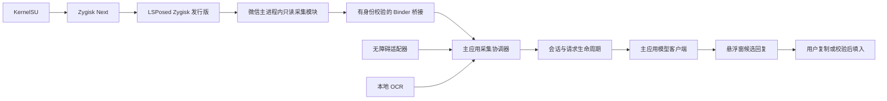

# V1.4 微信备用采集方案评估

> 已被 [V1.4 多平台 libxposed 设计与实施方案](v1.4-libxposed-multiplatform-design.md) 取代。以下保留最初评估背景，不再作为当前实施约束。最新要求是 libxposed 优先、QQ → 微信 → X → 飞书、效果优先；原文“仅微信”“可见 View 只读”“无障碍优先”“仍必须开启无障碍”“不允许宿主填入/内部数据层读取”等范围已调整，以新方案为准。

状态：方案草案，尚未实现、编译或验机。评估日期：2026-09-23；源码基线：`e367c51`，当前 `versionName=1.3`、`versionCode=4`。本文是 V1.4 的一个功能专题，不代表完整版本计划。

## 1. 结论与目标

建议将 **KernelSU + Zygisk Next + LSPosed + 对话攻略微信采集模块** 纳入 V1.4 的可选实验功能，默认关闭。普通用户继续使用无障碍与本地 OCR；已具备兼容环境的用户，可在微信节点不可读时启用进程内只读采集。

技术方向具有可行性，但当前不能承诺恢复成功。三件套提供的是模块运行环境，不负责识别微信聊天；关键工作仍是确认目标微信版本的页面、可见消息和会话身份，并验证跨进程传输及回调隔离。当前没有目标微信 APK、节点样本或该组合的设备实测记录，不能预先指定可靠的微信内部类名、方法名或支持版本。

首版建议范围：同一 Android 用户下，官方微信 `com.tencent.mm` 主进程中，前台打开的单聊文本消息。群聊、应用分身、工作资料、多账号身份复用、后台收信、完整历史、多媒体解析不纳入首批兼容承诺。若设备上的聊天 UI 不在主进程，此基线判为不支持，另行评估。

V1.4 仍保留无障碍服务作为现有悬浮窗、OCR 和填入能力的运行入口；新增的是独立于无障碍节点的**读取通道**，并非本期彻底移除无障碍权限。节点不可用时允许只复制回复，用户自行粘贴和发送。

## 2. 现状、缺口与证据边界

用户反馈：此前测试微信时无障碍节点为空，导致功能无效。本文将其记录为复现现象；“微信主动检测无障碍服务并屏蔽节点”仍是待验证原因。节点 ID 变化、窗口选择、权限状态和版本差异也可能造成当前适配器无结果，现有注释不能替代设备证据。

下列路径以 `app/src/main/java/io/github/liaong13/dialogueroute/` 为根，行号对应评估基线：

| 当前证据 | 静态结论 | 对方案的约束 |
| --- | --- | --- |
| `capture/ChatCaptureService.kt:160–166` | `rootInActiveWindow == null` 或适配器返回 `null` 都直接退出 | 新通道不能挂在这两个提前返回之后，也不能只依靠无障碍事件唤醒 |
| `capture/WeChatAdapter.kt:89–110` | 依赖 `com.tencent.mm:id/bkl`；找到气泡但无正文才返回空快照，否则返回 `null` | 节点树空、ID 变化或无法判页时，自动 OCR 不会启动 |
| `capture/ChatCaptureService.kt:175–186、313–318` | 已有自动 OCR；微信无气泡矩形时，OCR 签名仅由包名与标题组成 | 同一会话后续内容可能不再触发 OCR，不能把现有 OCR 描述为完整兜底 |
| `core/ChatModels.kt:36–37` | 内容签名只包含最后六条消息，没有会话 ID | 跨联系人、跨来源的相同正文不能共用去重身份 |
| `capture/ChatCaptureService.kt:234–282、475–558` | 标题按包名复用；分析回调和填入没有会话代次校验 | 多来源接入前必须补会话与请求生命周期管理 |
| `core/kb/ContextBuilder.kt:40–44` | 联系人按标题和应用匹配，启用历史时可能写入上下文 | 未知或同名身份不能自动匹配旧联系人、写入其历史 |
| `capture/ChatCaptureService.kt:208` | 当前日志仍输出标题 | 新通道不得沿用该日志内容；脱敏列为接入前置项 |

现有手动“截屏识别一次”是另一入口，不等同于自动 OCR 可触发。相关风险见[项目静态检查](project-review-2026-09-23.md)；以上关键控制流本次已重新核对，报告里的历史检查结果不作为本方案的验收结果。

为了定位原始失效，需要补充同一复现窗口的设备/系统/微信版本、无障碍启用状态、活动窗口包名、root 是否为空、节点总数、气泡 ID 是否存在、截图返回码。仅记录结构和计数，不导出真实聊天正文或联系人名称。即使最终发现是资源 ID 变化，备用通道仍可作为独立功能评估，但应另行修复原适配器。

## 3. 三件套职责与兼容性

| 层级 | 负责什么 | 不代表什么 |
| --- | --- | --- |
| KernelSU | 提供设备侧 root 与模块环境 | 不提供微信聊天解析；不能用 Android 大版本直接判断内核适配 |
| Zygisk Next | 在 KernelSU 环境提供 Zygisk 接口 | 不自动恢复 AccessibilityNodeInfo，也不等于 LSPosed 已注入微信 |
| LSPosed 的 Zygisk 发行版 | 在选定作用域加载 Xposed 模块、提供 hook API | 管理器显示“已启用”不代表聊天采集点命中 |
| 对话攻略微信采集模块 | 识别已适配页面，提取当前可见消息，发送快照 | 不读取数据库、不监听全量消息、不调用发送或支付接口 |
| 对话攻略主应用 | 校验快照、选择来源、管理会话与模型请求、展示回复 | 不获得微信 UID，也不因安装模块自动取得 root 权限 |

本轮核对的上游资料及其边界：

- KernelSU 安装指南要求结合实际设备支持情况、KMI 与安全补丁核对镜像；应用的 `minSdk=30` 不代表所有 Android 11 设备都能采用这一方案。本文中的 KernelSU 指用户指定项目，不将 KernelSU Next 的支持范围混用。[KernelSU 安装指南](https://kernelsu.org/guide/installation.html)
- Zygisk Next 的 `copyright` 分支 README 声明提供 KernelSU 的 Zygisk 支持，列出 KernelSU `10940`、Manager/ksud `11575` 的最低版本代码，并要求避免多套 root 实现并存。这是读取到的文档要求，不是本项目验证组合。仓库首页和 Releases 页面本轮抓取返回 404，未确认最新发布包；实施前须核对用户实际安装包的来源、版本和校验值。[Zygisk Next README 原文](https://raw.githubusercontent.com/Dr-TSNG/ZygiskNext/copyright/README.md)
- 原版 LSPosed README 标注 Android 8.1–14；不能据此承诺 Android 15–17。[原版 LSPosed README](https://github.com/LSPosed/LSPosed/blob/master/README.md)
- 本轮访问 `JingMatrix/LSPosed` 重定向到 `JingMatrix/Vector`，其 README 声明支持 Android 8.1–17 Beta、兼容 legacy 与 modern API。这仅说明存在后续发行路线；不等于用户安装的是该分支，也不证明其与 Zygisk Next 的目标版本组合已通过本项目验证。若需采用，应明确按 Vector 记录，不能混称原版 LSPosed。[Vector README](https://github.com/JingMatrix/Vector)

不写死“安装最新版即可”。首次 PoC 必须锁定 `设备/ROM/内核 + KernelSU/ksud + Zygisk Next + LSPosed发行来源/tag + 微信versionCode/签名 + 本模块版本`。系统 OTA、微信升级或任一框架升级后，重新验证相应组合；未验证的微信版本默认停止进程内正文采集。

依赖作为用户自行准备的外部运行环境，不打进 APK、不镜像分发。Zygisk Next 当前 README 明示限制修改、再分发与抽取组件，项目只链接来源；实际发布前复核所选版本声明。[Zygisk Next 版权声明](https://raw.githubusercontent.com/Dr-TSNG/ZygiskNext/copyright/README.md)

## 4. 采集方法选择

| 候选方法 | 收益与限制 | 本期决策 |
| --- | --- | --- |
| 修正现有节点规则 | 对 ID 漂移改动最小；无法解决真正的空节点树 | 保留，并与备用通道分开验收 |
| 本地截图 OCR | 不要求 root；受截图权限、窗口保护及文字/说话人识别限制 | 保留兜底，补正确触发及刷新条件 |
| 进程内读取聊天 View / 可见条目的绑定结果 | 不依赖无障碍导出的节点；需要逐版核验 UI 和会话定位 | 作为 V1.4 PoC 主方案 |
| 强行恢复微信无障碍输出或修改检测函数返回值 | 与检测机制耦合，可能改变宿主行为；当前无目标实现证据 | 不作为本期方向 |
| 数据库、网络收发、后台消息管线 | 范围超出当前前台聊天辅助，生命周期和隐私成本显著增加 | 不纳入 |

进程内采集先验证：在受支持聊天页的 UI 更新完成后，能否读取消息列表当前附着且可见的文字 View。若文字由自定义绘制承载，再评估该版本可见条目的数据绑定回调；只提取与当前可见行对应的文本，不遍历全量缓存、历史表或其他会话。

不能把全局 `TextView.setText()` hook 或“遍历所有字符串”作为正式采集器。页面判据须结合已验证的聊天容器、会话对象和可见窗口状态，排除列表、搜索、通讯录、朋友圈、收藏、支付及小程序页。滚动列表可能预绑定屏外行，绑定回调发生不代表消息可见。

每个微信适配版本记录页面特征、候选类/方法签名、消息容器、文本类型、自身/对方判定和会话标识来源；这些字段目前均待 PoC 取证。找不到、命中多义、类型不匹配或前台身份冲突时，返回明确的“不支持/身份未知”，停止该来源，不猜测消息归属。

只读指不改方法参数、返回值、消息状态和聊天内容；hook 本身仍会改变进程内执行环境，不能继续对外宣称“完全不 hook”。

## 5. 工程与数据流设计

以下模块名和接口名是建议，当前仓库仍只有 `:app`：

| 建议边界 | 职责 |
| --- | --- |
| `:app` | 原有 UI、模型、知识库；新增采集协调器和受限 Binder 服务 |
| `:wechat-capture`，独立模块 APK | Xposed 入口、版本适配、可见页面快照；只作用于 `com.tencent.mm`，入口再次检查主进程 |
| `:capture-protocol`，共享库 | AIDL/DTO、协议版本、大小限制与错误码；不依赖模型客户端、密钥或知识库 |

建议独立模块 APK，避免把模型 SDK、ML Kit 或知识库代码加载到微信。主应用保持可单独安装，Xposed API 只由模块编译期引用，运行时由框架提供。首轮 PoC 优先验证 legacy Xposed API 路线；正式锁版后再决定是否需要 modern API，不能混用两种入口配置。[Xposed 模块入口](https://api.xposed.info/reference/de/robv/android/xposed/IXposedHookLoadPackage.html)、[编译期 API 引用说明](https://github.com/rovo89/XposedBridge/wiki/Using-the-Xposed-Framework-API)

不将新采集器塞进要求 `AccessibilityNodeInfo` 的 `ChatAppAdapter.extract()`。保留旧三态契约，在其上增加来源协调层，接收无障碍、模块事件和 OCR 回调。桥接事件独立进入协调器，因此无障碍 root 为空、没有 content-change 事件时也能提交候选；是否可采用仍由前台与会话校验决定。

拟涉及的现有文件：`capture/ChatCaptureService.kt`、`core/ChatModels.kt`、`core/Prefs.kt`、`MainActivity.kt`、`SettingsActivity.kt`、`overlay/OverlayController.kt`、`core/kb/ContextBuilder.kt`，以及 Manifest、Gradle 配置和相关测试。新增协调器、Binder 服务及微信版本适配器按职责拆分。现有特殊无障碍服务类名无需因本功能迁移。

### 5.1 快照协议

传输不可变数据，不传 View、Activity、AccessibilityNodeInfo 或宿主内部对象。主应用将验证后的数据转换为通用分析快照。

| 字段组 | 建议字段与含义 |
| --- | --- |
| 协议/兼容 | `protocolVersion`、`moduleVersion`、`wechatVersionCode`、`adapterId` |
| 传输会话 | 主应用分配的 `bridgeEpoch`、短期 token、模块 `processEpoch`、递增 `sequence`；正文响应回传主应用发起的 `captureRequestId` |
| 页面/会话 | 当前 Android 用户、应用包、`pageEpoch`、不透明 `conversationKey`、`identityConfidence`、页面类型与前台/可见状态 |
| 时效/来源 | `capturedAtElapsedRealtime`、`source`、`contentRevision`；使用设备单调时钟，不靠墙钟排序 |
| 正文 | 有序消息的 `side`、`text`，必要时内存态消息 ID；未知方向必须显式表示，不能默认为 `other` |
| 辅助 | 展示标题、完整性/截断标记、可选可见区域；标题不是身份凭据 |

`conversationKey` 只取当前页面可核验的身份，并在模块进程内映射为不透明值。账号切换必须失效旧进程/页面代次；无法确认身份时只保留短期页面实例，禁止自动关联联系人。传给模型的数据不包含桥接 token、内部会话 ID 或设备身份。

### 5.2 跨进程通道

建议使用主应用提供的服务端点，例如 `WeChatCaptureBridgeService`，由微信进程内模块通过明确的 `ComponentName` 连接。只提供握手、状态更新、提交可见快照、撤销租约等窄接口；不提供读取主应用偏好、密钥、联系人或任意执行命令的接口。Binder 的适用性来自 Android 官方 IPC 建议，具体授权协议是本项目设计，待 PoC 验证。[Android IPC 安全说明](https://developer.android.com/privacy-and-security/security-tips)

- 服务跨 UID 通信需要导出，但不能仅凭 Intent extra 中的包名/token 接受调用。在每次 AIDL 事务入口校验实际调用 UID、同一 Android 用户、对应包及已登记的微信签名；随后才切换线程处理数据。`onBind()` 不是业务调用者身份校验的替代位置。[Binder 调用 UID](https://developer.android.com/reference/android/os/Binder#getCallingUid())
- 模块在连接前核验主应用签名；调试和发布证书配置隔离。微信证书从目标官方安装包取证，不硬编码猜测值；证书轮换、包升级和 UID 变化重新握手。
- 注入代码以**微信 UID**调用，不是模块 APK 的 UID。给服务加“与主应用同签名”的 `signature` 权限会挡住这条直连通道，不能把同签名模块 APK 当成身份依据。[Android 自定义权限](https://developer.android.com/guide/topics/permissions/defining)
- 助手启用且用户打开备用开关后，主应用才签发内存态短期租约；租约绑定调用 UID、桥接代次和页面代次。关闭、断连或服务销毁立即在主应用拒收；模块收到撤销或租约过期后停止正文提取。租约只通过已校验的 Binder 事务交换，不用公共广播、共享外存文件或固定口令分发。
- UID 与签名只能确认微信进程身份，不能证明同进程调用一定来自本模块。token 也不能抵御同 UID 恶意代码或 root 级攻击。因此桥接数据仍视为不可信输入，必须限长、限频、校验结构，且不能赋予对主应用私有数据的读取能力。
- 绑定失败、后台限制、包可见性或 Binder death 均进入降级状态；不通过 root 代理、放宽 SELinux 或无限拉起进程掩盖问题。必要的 `<queries>` 仅限定两个包，并在 PoC 验证包查询及显式绑定。

握手时登记带生命周期的模块回调 Binder，主应用通过它下发采集请求与撤销通知。模块先报告不含正文的页面/变更状态；协调器决定采用备用来源后才发起带 `captureRequestId` 的正文请求，模块按该请求重新采样，不能把旧缓存包装成新结果。页面切换、超时或来源切换后作废原请求 ID，即使桥接仍连接也拒绝其迟到正文。

## 6. 来源选择与生命周期

用户界面只需提供“微信备用采集（实验）”开关，默认关闭；显示当前来源和“未启用 / 等待微信 / 模块未连接 / 版本不支持 / 已连接 / 本次采集失败”等可理解状态。框架安装信息与模块握手、页面命中、收到有效快照分别检测，不用“检测到 root”替代“采集可用”。

建议优先级是 **有效无障碍正文 → 已启用且有效的进程内快照 → 满足条件的本地 OCR**。有效要求来源新鲜、页面明确、会话可核验、可见文本范围一致，不能只检查 `messages.isNotEmpty()`。

| 输入情况 | 协调器行为 |
| --- | --- |
| 无障碍正文与身份完整 | 采用无障碍；模块保持最小状态通道，不持续重复上传正文 |
| 已证明是聊天页，但无障碍无正文 | 请求模块当前页面快照；模块关闭、失败或超时再尝试已开启的 OCR |
| root 为空或适配器 `null`，模块能独立证明当前前台聊天页 | 允许采用模块快照；不要求先返回空的无障碍快照 |
| 两种来源都不能证明当前是聊天页 | 停止自动采集/分析；保留用户主动触发的单次 OCR 入口，不凭微信包名或普通搜索框自动截屏 |
| 来源明确判页/身份相互冲突 | 失效本轮请求，重新采集；不能把冲突视为低优先级来源自动覆盖 |
| 模块有效证明聊天页，但正文不可读 | 只有页面证明仍有效且 OCR 开关开启时才允许 OCR；不复用已经断连的页面证明 |
| 离开聊天、锁屏、关闭助手、关闭备用开关或服务销毁 | 取消对应租约/任务，清除旧候选和敏感缓存，拒绝迟到回调 |

适配器的 `null` 仍表示其未识别为聊天页；它既不触发原自动 OCR，也不能成为新模块的唯一判页信号。若只是节点缺失，与模块的独立有效证据并不构成明确冲突；若已看到列表页等直接证据，则必须按冲突处理。

模块必须独立上报页面进入/退出、前台可见性和内容变化；Activity `resumed` 不能单独证明聊天页可见。键盘、对话攻略悬浮窗、分屏、系统弹窗、屏幕关闭与锁屏都要分别验证；首版无法区分时暂停自动读取。根节点不可用时，依靠已验证的宿主窗口生命周期和短租约确认时效，过期即停止，不能回退为“最后一次是微信”。

采集通道切换不得拼接两份消息列表，也不得单凭正文相同认定同会话。未证明来源身份映射时，新建会话代次、丢弃旧结果，再处理新快照。来源恢复可在下一次有效采集时切回；失败退避与来源选择分开，避免每个 UI 事件反复切换和重复计费。

### 必须先处理的共用状态

1. **会话身份**：先处理 `conversationKey/pageEpoch` 变化，再做内容去重。标题只负责展示；禁止按包名沿用上一联系人标题。同名联系人、未知身份不能自动使用联系人知识库、白名单或写入历史，需明确关联后才启用。
2. **分析请求**：每次提交绑定会话代次、内容版本和 `requestId`。判断、回复、OCR、知识库构建和 UI 回调都验证代次；两路完成状态独立保存，允许任意完成顺序。忙碌时只保留最新待处理快照，完成后消费它。
3. **失效处理**：退出、关闭、断连、页面切换先使代次失效，再取消延迟任务和可取消工作。取消不是回调不会发生的保证；过期结果仍必须拒绝展示、历史写入和后续网络调用。已发出的网络请求无法通过关开关追回。
4. **填入约束**：候选绑定原会话；用户点击和实际写入前再次确认当前会话、页面和输入控件。不能确认就只复制。V1.4 不新增通过 hook 写输入框或调用微信发送方法的通道，也不按坐标点击发送。
5. **OCR 刷新**：修复仅按包名/标题去重的永久抑制，使用有界重试与有效期；保留限频、失败退避、超时清理和 Bitmap 释放。模块给出的矩形必须注明坐标系，并转换到截图原点，不能直接套用。
6. **数据与日志**：正文只在必要的内存队列中短暂保存；历史维持默认关闭，开启后仍只写主应用私有目录。日志只记录版本、错误码、计数、耗时和短期请求代次，不记录正文、标题、稳定联系人标识、token 或 API Key。模型调用及错误脱敏仍由主应用统一处理。

## 7. 稳定性与性能约束

hook 回调只发轻量变更信号；需要读取 View 时在宿主 UI 线程执行有时间/数量上限的采样，序列化与 IPC 移到独立队列。不得在微信主线程执行模型请求、OCR、文件读写、阻塞 Binder 往返或整包类扫描。仅持有弱引用或页面有效期内的短引用，退出后释放。

建议 PoC 初始预算如下，均为待测参数，不是已取得的性能结果：

| 项目 | 初始限制 |
| --- | --- |
| UI 变更合并 | 300 ms 防抖，每秒最多 2 次正文快照；队列只保留最新一份 |
| UI 采样 | 每个任务目标不超过 4 ms，遍历有节点数上限；超预算放弃本轮，不做主线程无限重试 |
| 数据量 | 最多 50 条可见消息、单条最多 4,000 字符、序列化总量最多 64 KiB；截断显式标记，不冒充完整消息 |
| 请求时限 | 模块单次快照等待最多 1.5 s；超时才允许符合条件的 OCR，迟到结果按原请求代次丢弃 |
| 新鲜度 | 快照接收时距采样不超过 3 s；手动分析/填入前另查当前页面状态，不把旧快照 TTL 当作永久会话证明 |
| 租约 | 暂定 5 s，使用有效前台状态续约；断连/禁用立即拒收，模块最迟到期停止采集 |
| 失败处理 | 连续 3 次解析异常暂停当前页面采集，重连采用有上限退避；未知版本直接停止，不反复试探 |

正式阈值由目标机测量调整。记录 UI 采样与端到端延迟分位数、CPU/内存趋势、ANR/崩溃及截图次数；不能以“只读”为理由跳过宿主稳定性验收。Java 异常隔离只能覆盖可捕获异常，无法保证拦住 native 崩溃或框架问题。

禁用开关只保证停止业务采集及拒收，不能宣称立即从微信卸载 hook。需要彻底移除注入时，由用户在框架中禁用本模块作用域，并按所选框架要求重启微信/设备。测试前保留设备原始启动镜像和框架恢复入口；本方案不自动刷机或安装三件套。[KernelSU 恢复准备](https://kernelsu.org/guide/installation.html)

## 8. 实施阶段与验收门槛

| 阶段 | 交付物 | 进入下一阶段的条件 |
| --- | --- | --- |
| P0：复现与兼容基线 | 版本组合、匿名节点结构/计数、截图状态、原始失效分类 | 确认三件套来源与适配环境，复现现有路径失败；不将猜测写成根因 |
| P1：最小只读 PoC | 独立模块，单个微信版本，页面识别、可见文本与身份、带校验的 Binder 握手 | root 为空时仍能得到正确前台快照；退出即失效；不连接真实模型、不自动落盘正文 |
| P2：主应用共用状态 | 会话代次、请求管理、结果合并、填入校验、联系人隔离与日志脱敏 | 用假数据源验证切换、乱序、关闭、同文/同名及知识库隔离，再接入第二来源 |
| P3：备用通道集成 | 默认关闭的设置项、状态诊断、来源选择、失败恢复、OCR 联动 | 模块缺失或关闭时普通路径可用；模块与 OCR 迟到不覆盖新快照；模型只调用一次 |
| P4：兼容与发布 | 实测矩阵、脱敏诊断、安装/关闭说明、主应用与模块 APK 的对应版本 | 发布门槛全部通过；只列通过的组合，不宣传全版本微信支持 |

P1 最关键的四项未知量是：可见正文是否可取、页面是否可可靠区分、会话是否可隔离、受限 Binder 通道是否可用。任一项在目标基线上不成立，就将本功能保留为研发实验，不对用户开放自动分析；不通过数据库读取或关闭系统安全机制扩大范围来凑验收。

实施时更新 `AGENTS.md` 中相关行为边界、开发指南、隐私说明及安装说明；本轮只登记方案范围。应用版本号、Gradle 模块、Manifest 和业务代码均在后续实施阶段修改，不因完成本文将版本改为 1.4。

### 功能与回归用例

以下均为计划用例，尚未执行。使用用户自有测试设备、测试会话和虚构正文；自动回归用假客户端，不调用收费模型接口。

| 场景 | 必须观察的结果 |
| --- | --- |
| 无 root / 未安装模块 / 开关关闭 | 启动与无障碍/OCR 不依赖 Xposed 类；模块通道不上传正文 |
| 节点无正文、root 为空、`bkl` 缺失三种情况 | 分别记录；模块可独立唤醒协调器，不被原 early-return 截断 |
| 列表、搜索、朋友圈、收藏、支付、小程序、群聊 | 模块拒绝正文采集；不误发起自动 OCR/模型分析 |
| A→B→A，A/B 标题相同或正文相同，标题空/延迟 | 页面与会话代次正确变化；不复用 A 的判断、联系人或历史到 B |
| 新消息、连续滚动、屏外预绑定、重复正文 | 顺序与说话人正确，只包含当前可见行；最新内容不被忙碌或去重吞掉 |
| 判断/回复反向完成，网络错误，OCR/模块迟到 | 同请求正常合并，旧请求不能重绘或触发下一轮调用 |
| 关闭助手、关闭备用开关、离开聊天、锁屏 | 主应用立即拒收并清除候选；模块停止正文提取，租约不再续期 |
| 键盘、浮窗、旋转、分屏、系统覆盖窗口 | 能确认原聊天仍可见才采样；无法确认时暂停，不误读取覆盖页 |
| 主应用/微信进程重建、模块断连、协议不匹配 | 新 epoch 握手；旧包、旧 token、旧序号均被拒绝；有限退避不死循环 |
| 伪包名、错误 UID/证书、乱序、重放、超长包、频繁调用 | 业务接口拒绝或限流；不能读取密钥、联系人或执行任意操作 |
| 备用采集成功但输入节点不可读 | 可复制，用户自行粘贴；无 hook 填入/自动发送 |
| 历史默认关闭、同名联系人、启用历史后切人 | 默认不落盘；只有明确关联的当前会话写入对应联系人 |
| 微信/系统/框架升级，未知签名/版本，应用分身 | 停用该通道并提示未支持，不沿用旧 hook 点；普通通道独立判断是否可用 |
| 持续聊天、快速切页和失败重试 | 无新增宿主崩溃/ANR，无持续内存增长；记录测量时长、样本数和性能数据 |

发布建议至少在首发组合完成 100 次 A/B 往返切换和 30 分钟前台运行，统计正确率及故障；这些是计划门槛，不能证明其他组合稳定。静态与 JVM 检查只能验证协议/状态机；真实微信 hook、窗口可见性、绑定限制和宿主性能必须验机。

## 9. 风险与停止条件

| 风险 | 影响与处理 |
| --- | --- |
| 微信或框架更新使适配失效 | 用明确版本白名单与诊断码停止该来源；允许回到原有通道，兼容更新单独验证 |
| 宿主卡顿、崩溃、启动异常 | 最小作用域、有界采样与错误隔离；可关闭模块恢复，不承诺所有异常可捕获 |
| root/hook 被目标应用识别 | 不能承诺不被检测或账号不受影响；本功能不提供隐藏 root、规避风控或修改检测逻辑的能力 |
| 会话/知识库串用 | 属于发布阻断问题；不能以“正文读到了”作为可上线依据 |
| 正文经桥接或日志泄露 | 窄接口、校验调用身份、最小内存队列和脱敏；root 环境不具备对其他 root 组件的隔离保证 |
| 配置和安装成本上升 | 单独模块、默认关闭，完整记录发行来源；未 root 用户不需要准备该环境 |
| 原功能边界变化 | 明确说明启用后会向微信进程加载只读模块，聊天仍可能发送到用户配置的模型服务；不宣称“无侵入/已加密” |

出现跨会话数据、后台正文采集、不能撤销的持续采集、宿主稳定性回退或不可校验的 IPC 身份时，停止发布该功能，先修复并补对应回归。若只有复制可用，应如实展示，不把填入失败伪装成成功。

## 10. 待补信息与本轮交付边界

| 基线项目 | 当前状态 |
| --- | --- |
| 手机型号、ROM/Android 构建、内核/KMI、ABI | 待提供；普通应用现有配置为 API 30+、`arm64-v8a` |
| 微信 versionName/versionCode、官方来源、签名、分身情况 | 待提供；未检查目标 APK |
| KernelSU 内核/管理器、Zygisk Next 版本与来源 | 待提供；未安装或探测设备 |
| LSPosed 具体发行仓库/tag、API、作用域 | 待提供；原版与 Vector 等分支须分开记录 |
| 空节点复现步骤、出现频率、结构信息与截图返回码 | 仅有用户现象反馈，无本轮运行时证据 |
| 正文/页面/身份提取点，Binder 与性能结果 | 待 PoC；当前没有任何已验证兼容组合 |

本轮完成当前源码路径核对、上游资料查阅、方案及文档入口整理；检查只覆盖文档差异、空白和本地链接。未修改业务代码、构建配置或设备，未编译、未运行测试、未调用模型接口、未验机，也没有可以宣称已消除的运行时 fatal。下一阶段从 P0/P1 的证据与最小 PoC 开始，是否纳入正式 V1.4 发布由验收结果决定。
